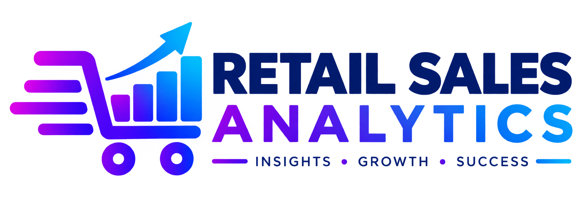
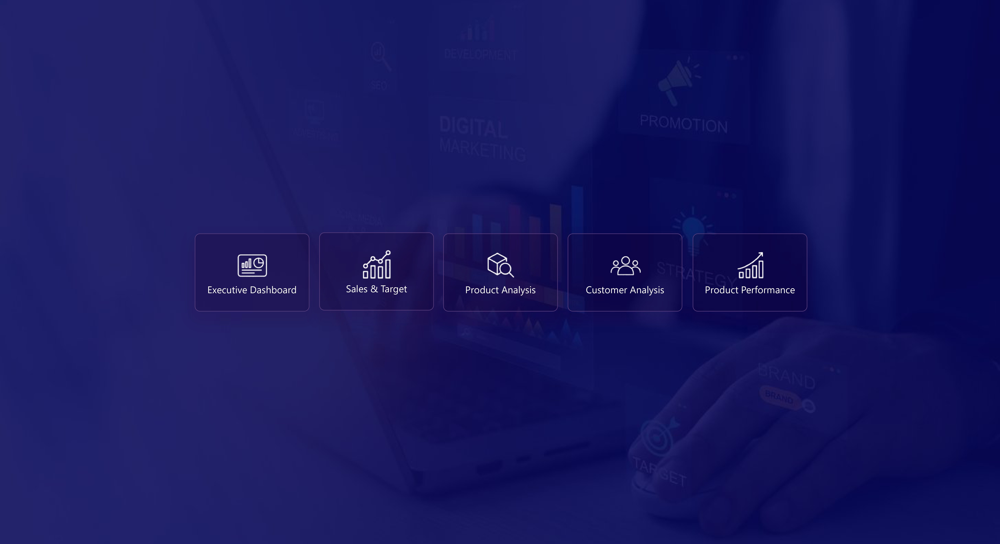
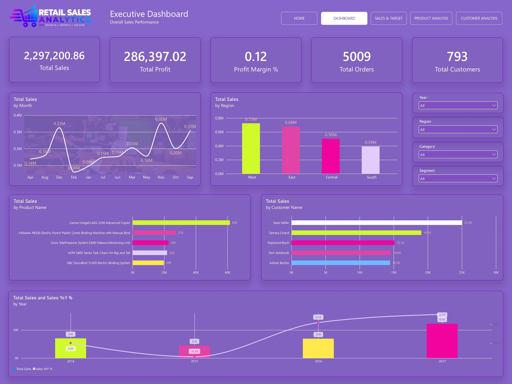
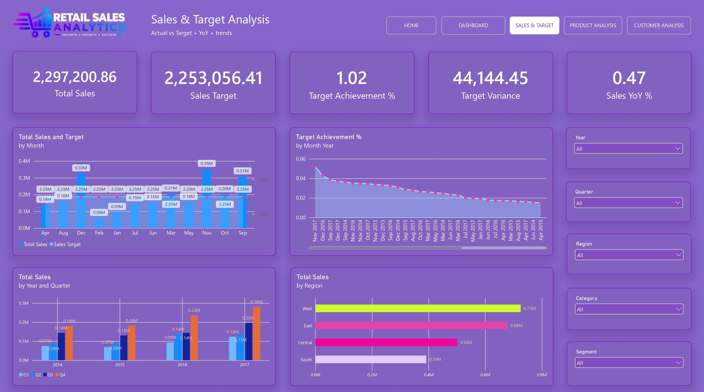
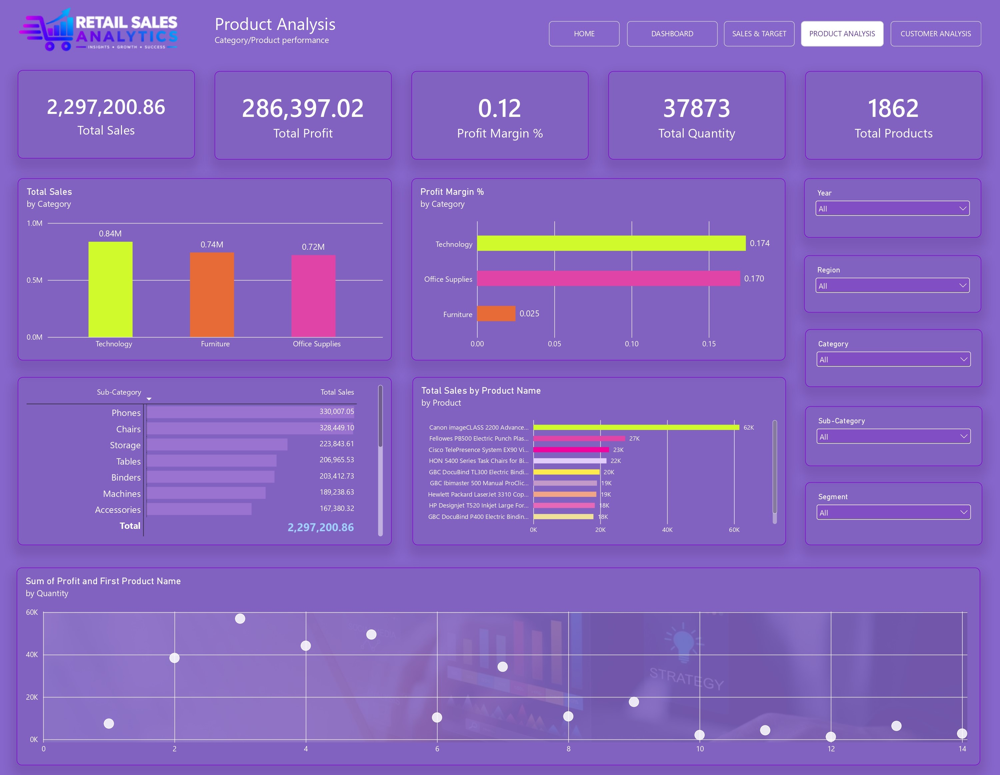
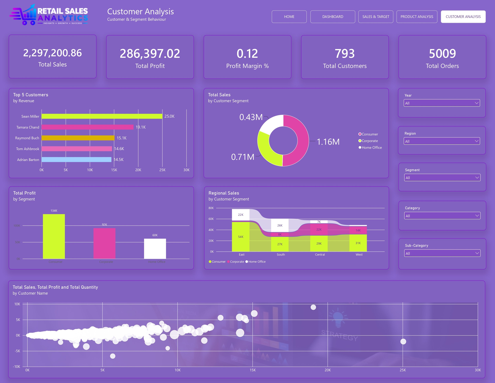
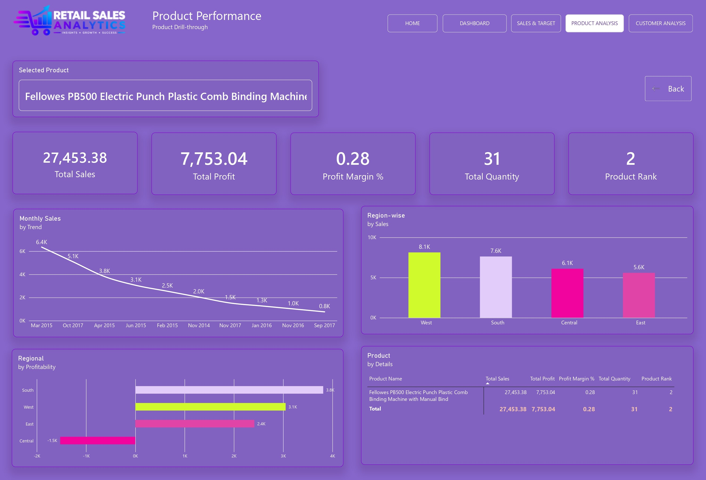
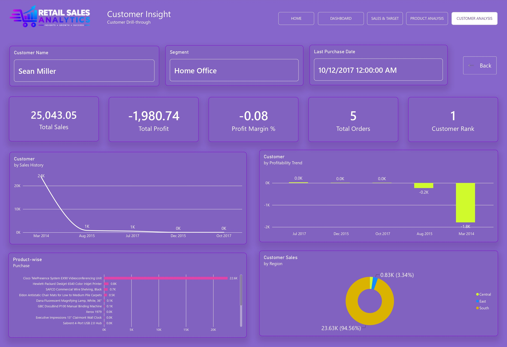
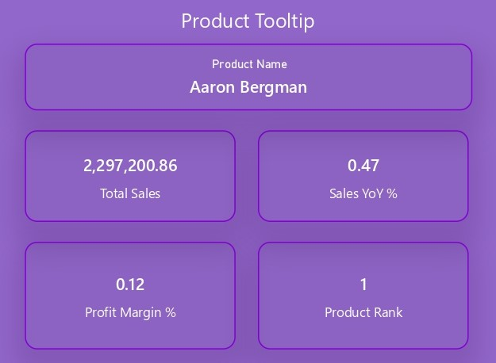

# Retail Sales & Customer Analytics — Power BI



A complete **Power BI retail analytics project** built using the Superstore sales dataset.  
The project focuses on **sales performance, profitability, customers, products, targets, YoY analysis, drill-through analysis, ranking, contribution %, and interactive business insights**.

---

## 📌 Project Overview

Retail Sales & Customer Analytics is an interactive Power BI business intelligence project built using the Superstore retail dataset. It provides insights into sales, profit, profit margin, customers, products, regions, segments, and sales target performance through interactive dashboards, DAX measures, time-intelligence analysis, rankings, drill-through pages, and report-page tooltips.

The project includes Executive Dashboard, Sales & Target, Product Analysis, Customer Analysis, Product Performance, and Customer Insights pages, helping users identify top-performing products and customers, analyze YoY sales trends, measure target achievement, understand profitability, and explore detailed product/customer performance.

### Main Business Areas

- Executive sales performance
- Profit and profit margin analysis
- Sales target achievement
- Year-over-Year (YoY) comparison
- Product performance
- Customer performance
- Region and segment analysis
- Top products and customers
- Quantity vs Profit relationship
- Product drill-through
- Customer drill-through
- Interactive slicers and cross-filtering
- Tooltip-based quick insights

---

## 📂 Project Structure

```text
Retail-Sales-Customer-Analytics/
│
├── README.md
│
├── PowerBI/
│   └── Retail_Sales_Customer_Analytics.pbix
│
├── Dataset/
│   └── Superstore.csv
│
├── Screenshots/
│   ├── Home.jpg
│   ├── Dashboard.jpg
│   ├── Sales-Target.jpg
│   ├── Product-Analysis.jpg
│   ├── Customer-Analysis.jpg
│   ├── Product-Performance.jpg
│   ├── Customer-Insight.jpg
│   └── Tooltip-Quick-Insights.jpg
│
└── Assets/
    └── logo.png
```

> The README is prepared with all planned page sections. Add the remaining page screenshots to the `Screenshots` folder using the filenames above.

---

# 📊 Dashboard Pages

## 1. Home

The Home page is designed as the project landing/navigation page.

### Navigation

- Dashboard
- Sales & Target
- Product Analysis
- Customer Analysis
- Product Performance
- Customer Insights

The page uses a clean navigation layout with project branding and icons.

### Screenshot



---

# 2. Executive Dashboard

The Executive Dashboard provides a high-level view of the complete retail business.

### KPI Cards

- Total Sales
- Total Profit
- Profit Margin %
- Total Orders
- Total Customers

### Filters / Slicers

- Year
- Region
- Category
- Segment

### Visuals

- Monthly Sales Trend
- Region-wise Sales
- Top 5 Products
- Top 5 Customers
- YoY Sales Performance
- Category / Segment performance

### Business Questions Answered

- How much sales did the business generate?
- How profitable is the business?
- Which region generates the highest sales?
- Which products generate the most revenue?
- Which customers contribute the most revenue?
- How is sales changing compared with the previous year?

### Screenshot



---

# 3. Sales & Target

This page compares actual sales against a dynamically calculated sales target.

### KPI Cards

- Actual Sales
- Sales Target
- Target Achievement %
- Target Variance
- YoY %

### Slicers

- Year
- Quarter
- Region
- Category
- Segment

### Visuals

- Monthly Actual Sales vs Target
- Target Achievement %
- Quarterly Sales
- Region-wise Sales
- Variance analysis

### Target Logic

The target is calculated from the previous year's same month sales with a **10% growth target**.

For months where previous-year sales are not available, actual sales are used as the base and increased by 10%.

### Screenshot



---

# 4. Product Analysis

This page analyzes products, categories and sub-categories.

### KPI Cards

- Total Sales
- Total Profit
- Profit Margin %
- Total Quantity
- Total Products

### Slicers

- Year
- Region
- Category
- Segment
- Sub-Category

### Visuals

- Sales by Category
- Profit Margin by Category
- Sales by Sub-Category
- Top 10 Products
- Quantity vs Profit Scatter Chart

### Scatter Analysis

The scatter chart compares:

- X Axis → Total Sales
- Y Axis → Total Profit
- Size → Total Quantity
- Values → Customer / Product dimension depending on the analysis
- Tooltips → Ranking and profitability measures

### Business Questions

- Which category generates the highest sales?
- Which category has the strongest profit margin?
- Which products generate the highest revenue?
- Is higher quantity associated with higher profit?

### Screenshot



---

# 5. Customer Analysis

This page focuses on customer revenue, profitability and segmentation.

### KPI Cards

- Total Sales
- Total Profit
- Profit Margin %
- Total Customers
- Total Orders

### Slicers

- Year
- Region
- Segment
- Category
- Customer Name
- State

### Visuals

- Top 5 Customers by Revenue
- Sales by Customer Segment
- Profit by Segment
- Regional Sales by Customer Segment
- Customer Sales vs Profit Scatter Chart

### Business Questions

- Who are the top revenue-generating customers?
- Which segment contributes the most sales?
- Which segment generates the most profit?
- How does customer profitability vary?
- Which regions perform strongly across customer segments?

### Screenshot



---

# 6. Product Performance — Drill-Through

The Product Performance page is a dedicated **Product Drill-Through page**.

Users can right-click a product from a product visual and navigate to this page for detailed analysis.

### Drill-Through Field

```text
FactSales[Product Name]
```

### Drill-Through Configuration

- Drill-through field → Product Name
- Keep all filters → ON
- Back button → Enabled

### Product Header

The selected product name is displayed dynamically.

Example:

```text
Selected Product
"While you Were Out" Message Book, One Form per Page
```

### KPI Cards

- Product Name
- Total Sales
- Total Profit
- Profit Margin %
- Total Quantity
- Product Rank

### Detailed Visuals

- Monthly Sales Trend
- Profit Margin Trend
- Region-wise Sales
- Regional Profitability
- Sales Contribution %
- Product Detail Table

### Product-Level Insights

The page helps answer:

- How much revenue does this product generate?
- How profitable is the product?
- What is its profit margin?
- Which regions buy the product?
- How does product sales change over time?
- What is the product's sales rank?
- What percentage of total sales comes from this product?

### Screenshot



---

# 7. Customer Insights — Drill-Through

The Customer Insights page is designed as the detailed **Customer Drill-Through page**.

### Drill-Through Field

```text
FactSales[Customer Name]
```

### Drill-Through Configuration

- Drill-through field → Customer Name
- Keep all filters → ON
- Back button → Enabled

### KPI Cards

- Customer Name
- Total Sales
- Total Profit
- Profit Margin %
- Total Orders
- Customer Rank

### Customer Analysis

- Customer Sales History
- Profitability Trend
- Product-wise Purchase
- Region
- Segment
- Last Purchase Date
- Customer Contribution %

### Business Questions

- How much revenue does the customer generate?
- How profitable is the customer?
- What products does the customer purchase?
- Which region does the customer belong to?
- Which segment does the customer belong to?
- When was the customer's last purchase?
- What percentage of overall sales comes from this customer?

### Screenshot



---

# 8. Tooltip — Quick Insights

A report-page tooltip is planned for quick contextual insights.

### Tooltip Page Settings

```text
Page Size → Tooltip
Page Information → Tooltip = ON
```

### Product Tooltip

- Product Name
- Total Sales
- Sales YoY %
- Product Rank
- Sales Contribution %
- Profit Margin %

### Customer Tooltip

- Customer Name
- Total Sales
- Customer Rank
- Customer Contribution %
- Last Purchase Date
- Profit Margin %

### Screenshot



---

# 🧮 DAX Measures

## Basic Measures

### Total Sales

```DAX
Total Sales =
SUM(FactSales[Sales])
```

### Total Profit

```DAX
Total Profit =
SUM(FactSales[Profit])
```

### Total Quantity

```DAX
Total Quantity =
SUM(FactSales[Quantity])
```

### Total Orders

```DAX
Total Orders =
DISTINCTCOUNT(FactSales[Order ID])
```

### Profit Margin %

```DAX
Profit Margin % =
DIVIDE(
    [Total Profit],
    [Total Sales],
    0
)
```

### Total Customers

```DAX
Total Customers =
DISTINCTCOUNT(FactSales[Customer ID])
```

### Total Products

```DAX
Total Products =
DISTINCTCOUNT(FactSales[Product ID])
```

### Average Sales per Quantity

```DAX
Average Sales per Quantity =
DIVIDE(
    [Total Sales],
    [Total Quantity],
    0
)
```

---

# 📈 YoY Measures

### Sales LY

```DAX
Sales LY =
CALCULATE(
    [Total Sales],
    SAMEPERIODLASTYEAR(DimDate[Date])
)
```

### Sales YoY

```DAX
Sales YoY =
[Total Sales] - [Sales LY]
```

### Sales YoY %

```DAX
Sales YoY % =
DIVIDE(
    [Sales YoY],
    [Sales LY],
    0
)
```

---

# 🎯 Sales Target Measures

## SalesTarget Table

The project uses a target table based on previous-year monthly sales plus a 10% target increase.

```DAX
SalesTarget =
VAR MonthlySales =
    SUMMARIZE(
        FactSales,
        DimDate[Year],
        DimDate[Month Number],
        "Actual Sales", [Total Sales]
    )
RETURN
    ADDCOLUMNS(
        MonthlySales,
        "Target",
            VAR CurrentYear = [Year]
            VAR CurrentMonth = [Month Number]
            VAR PreviousYearSales =
                CALCULATE(
                    [Total Sales],
                    FILTER(
                        ALL(DimDate),
                        DimDate[Year] = CurrentYear - 1
                            && DimDate[Month Number] = CurrentMonth
                    )
                )
            RETURN
                IF(
                    NOT ISBLANK(PreviousYearSales),
                    PreviousYearSales * 1.10,
                    [Actual Sales] * 1.10
                )
    )
```

### Sales Target

```DAX
Sales Target =
SUM(SalesTarget[Target])
```

### Target Achievement %

```DAX
Target Achievement % =
DIVIDE(
    [Total Sales],
    [Sales Target],
    0
)
```

### Target Variance

```DAX
Target Variance =
[Total Sales] - [Sales Target]
```

### Target Variance %

```DAX
Target Variance % =
DIVIDE(
    [Target Variance],
    [Sales Target],
    0
)
```

---

# 🏆 Product Ranking Measures

### Product Rank

```DAX
Product Rank =
RANKX(
    ALL(FactSales[Product Name]),
    [Total Sales],
    ,
    DESC,
    DENSE
)
```

### Sales Contribution %

```DAX
Sales Contribution % =
DIVIDE(
    [Total Sales],
    CALCULATE(
        [Total Sales],
        ALL(FactSales[Product Name])
    ),
    0
)
```

---

# 👥 Customer Ranking Measures

### Customer Rank

```DAX
Customer Rank =
RANKX(
    ALL(FactSales[Customer Name]),
    [Total Sales],
    ,
    DESC,
    DENSE
)
```

### Last Purchase Date

```DAX
Last Purchase Date =
MAX(FactSales[Order Date])
```

### Customer Contribution %

```DAX
Customer Contribution % =
DIVIDE(
    [Total Sales],
    CALCULATE(
        [Total Sales],
        ALL(FactSales[Customer Name])
    ),
    0
)
```

---

# 📅 Date Dimension

The project uses a dedicated `DimDate` table for time intelligence.

```DAX
DimDate =
ADDCOLUMNS(
    CALENDAR(
        MIN(FactSales[Order Date]),
        MAX(FactSales[Order Date])
    ),
    "Year", YEAR([Date]),
    "Month Number", MONTH([Date]),
    "Month", FORMAT([Date], "MMM"),
    "Month Year", FORMAT([Date], "MMM YYYY"),
    "Quarter", "Q" & FORMAT([Date], "Q"),
    "Year Month", FORMAT([Date], "YYYY-MM")
)
```

### Sorting

```text
Month → Sort by Month Number
Month Year → Sort by Year Month
```

### Relationship

```text
DimDate[Date]
        1
        |
        *
FactSales[Order Date]
```

The `DimDate` table is marked as the model's Date Table using the `Date` column.

---

# 🔗 Sales Target Relationship

A Year-Month key is used to connect the target table.

### DimDate

```DAX
YearMonthKey =
DimDate[Year] * 100 + DimDate[Month Number]
```

### SalesTarget

```DAX
YearMonthKey =
SalesTarget[Year] * 100 + SalesTarget[Month Number]
```

### Relationship

```text
DimDate[YearMonthKey]  1 : *  SalesTarget[YearMonthKey]
```

---

# 🔍 Drill-Through Architecture

## Product Drill-Through

```text
Product Visual
      ↓
Right Click Product
      ↓
Drill Through
      ↓
Product Performance
      ↓
Selected Product Details
```

Field:

```text
FactSales[Product Name]
```

---

## Customer Drill-Through

```text
Customer Visual
      ↓
Right Click Customer
      ↓
Drill Through
      ↓
Customer Insights
      ↓
Selected Customer Details
```

Field:

```text
FactSales[Customer Name]
```

---

# 🎛️ Interactive Filters

The report uses slicers to make the analysis interactive.

### Common Filters

- Year
- Region
- Category
- Segment

### Additional Filters

- Quarter
- Sub-Category
- Customer Name
- State

The slicers allow users to dynamically change KPIs, charts, rankings and drill-through context.

---

# 📊 Key Business Insights

The report is designed to answer the following business questions:

### 1. Highest Total-Sales Region

Compare total sales by Region to identify the region contributing the highest revenue.

### 2. Monthly Sales Trend

Use the monthly sales trend together with Year/Month filters to compare sales performance over time and across years.

### 3. Top 5 Customers

Use Customer Rank and Total Sales to identify the five highest-revenue customers.

### 4. Highest Profit Margin Category

Compare Profit Margin % across product categories.

### 5. Sales Target Achievement

Use:

```text
Target Achievement %
```

to compare actual sales with the calculated target.

### 6. Quantity vs Profit Relationship

The scatter analysis compares:

```text
Quantity ↔ Profit
```

while Sales can be used as the X-axis and Profit as the Y-axis with Quantity controlling bubble size.

### 7. Significant Sales Drop

The monthly trend and YoY measures can be used to identify months where sales fall significantly compared with the previous period/year.

### 8. Most Profitable Customer Segment

Compare Total Profit and Profit Margin % across:

- Consumer
- Corporate
- Home Office

---

# 🧱 Data Model

### Main Fact Table

```text
FactSales
```

Contains transactional sales information including:

- Order ID
- Order Date
- Ship Date
- Customer ID
- Customer Name
- Segment
- Region
- State
- Category
- Sub-Category
- Product ID
- Product Name
- Sales
- Quantity
- Profit
- Ship Mode
- Row ID
- Other Superstore fields
```

### Dimension / Supporting Tables

```text
DimDate
SalesTarget
```

---

# 🛠️ Technologies Used

- Power BI Desktop
- Power Query
- DAX
- Microsoft Excel / CSV
- Data Modelling
- Time Intelligence
- Interactive Visualizations
- Drill-Through
- Report Page Tooltips

---

# 📌 Power BI Concepts Demonstrated

This project demonstrates practical knowledge of:

- Data loading
- Data cleaning
- Power Query
- Star-schema style modelling
- Date table creation
- Relationships
- DAX measures
- Time intelligence
- SAMEPERIODLASTYEAR
- CALCULATE
- FILTER
- ALL
- DIVIDE
- RANKX
- SUMMARIZE
- ADDCOLUMNS
- KPI design
- Slicers
- Cross-filtering
- Scatter analysis
- Drill-through pages
- Report page tooltips
- Target vs Actual analysis
- Contribution analysis
- Business KPI reporting

---

# 📷 Screenshots

Add the final screenshots to:

```text
Screenshots/
```

with these names:

| Page | Screenshot |
|---|---|
| Home | `Home.png` |
| Executive Dashboard | `Dashboard.png` |
| Sales & Target | `Sales-Target.png` |
| Product Analysis | `Product-Analysis.png` |
| Customer Analysis | `Customer-Analysis.png` |
| Product Performance | `Product-Performance.png` |
| Customer Insights | `Customer-Insights.png` |
| Tooltip | `Tooltip-Quick-Insights.png` |

---

# ▶️ How to Open the Project

1. Download or clone this repository.
2. Open the `.pbix` file using **Power BI Desktop**.
3. If required, update the dataset file path.
4. Refresh the data.
5. Explore the dashboard pages.
6. Use slicers for filtering.
7. Right-click a Product or Customer to test Drill Through.

---

# 📁 Dataset

The project is based on the **Superstore retail sales dataset**.

The dataset contains transactional sales information across:

- Orders
- Customers
- Products
- Categories
- Regions
- Sales
- Quantity
- Profit

> If the dataset is redistributed publicly, include the original dataset/source attribution in the repository according to its source license.

---

# 👨‍💻 Project Author

**Anees Nechiyan**

Power BI Developer | Data Analyst | Business Intelligence

### Focus Areas

- Power BI
- SQL
- DAX
- Data Analytics
- Business Intelligence
- Dashboard Development
- Data Visualization
- Python Automation

---

## ⭐ Project Highlights

This project demonstrates an end-to-end Power BI workflow:

```text
Raw Dataset
     ↓
Power Query / Data Preparation
     ↓
Data Model
     ↓
Date Dimension
     ↓
DAX Measures
     ↓
KPI Dashboard
     ↓
Sales & Target Analysis
     ↓
Product Analysis
     ↓
Customer Analysis
     ↓
Product Drill-Through
     ↓
Customer Drill-Through
     ↓
Tooltip Insights
```

---

## 📌 Portfolio Use

This project can be used as a portfolio demonstration for:

- Power BI Developer
- Data Analyst
- Business Intelligence Analyst
- Reporting Analyst
- BI Developer

It showcases both **technical Power BI skills** and **business-focused analytical thinking**.
